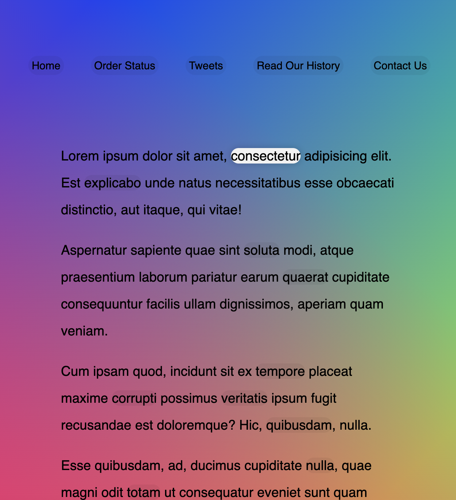

# Follow_along_links

This is a 30-days javascript grinding  
js30 [https://github.com/ningh98/js30]  
22. Follow_along_links [https://github.com/ningh98/Follow_along_links]

## Table of contents

- [Overview](#overview)
  - [Screenshot](#screenshot)
  - [Links](#links)
- [My process](#my-process)
  - [Built with](#built-with)
  - [What I learned](#what-i-learned)


## Overview

This document creates a web page with a navigation menu and a dynamic highlight effect that follows the user's mouse over the links.

### Screenshot




### Links

- Live Site URL: [https://ningh98.github.io/Follow_along_links/]

## My process

### Built with

- HTML
- CSS
- Javascript


### What I learned


```js
const triggers = document.querySelectorAll('a')
const highlight = document.createElement('span')
highlight.classList.add('highlight')
document.body.append(highlight)

function hightlightLink(){
    const linkCoords = this.getBoundingClientRect()
    console.log(linkCoords)
    const coords = {
    width: linkCoords.width,
    height: linkCoords.height,
    top: linkCoords.top + window.scrollY,
    left: linkCoords.left + window.scrollX
    }
    highlight.style.width = `${coords.width}px`
    highlight.style.height = `${coords.height}px`
    highlight.style.transform = `translate(${coords.left}px, ${coords.top}px)`
    

}

triggers.forEach(a => a.addEventListener('mouseenter', hightlightLink))
```